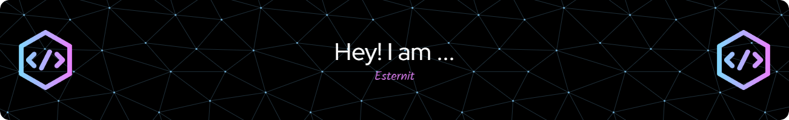

 


  [](https://github.com/ryo-ma/github-profile-trophy)


<!--START_SECTION:activity-->
1. 🎉 Merged PR [#3](https://github.com/Esternit/DurakFrontend/pull/3) in [Esternit/DurakFrontend](https://github.com/Esternit/DurakFrontend)
<!--END_SECTION:activity-->
<!--START_SECTION:waka-->

```txt
Docker       38 mins         ███████████▒░░░░░░░░░░░░░   44.86 %
Text         16 mins         ████▓░░░░░░░░░░░░░░░░░░░░   18.74 %
YAML         10 mins         ███░░░░░░░░░░░░░░░░░░░░░░   12.43 %
Python       10 mins         ███░░░░░░░░░░░░░░░░░░░░░░   11.97 %
Markdown     8 mins          ██▓░░░░░░░░░░░░░░░░░░░░░░   10.13 %
```

<!--END_SECTION:waka-->
<!--
**Esternit/Esternit** is a ✨ _special_ ✨ repository because its `README.md` (this file) appears on your GitHub profile.

Here are some ideas to get you started:

- 🔭 I’m currently working on ...
- 🌱 I’m currently learning ...
- 👯 I’m looking to collaborate on ...
- 🤔 I’m looking for help with ...
- 💬 Ask me about ...
- 📫 How to reach me: ...
- 😄 Pronouns: ...
- ⚡ Fun fact: ...
-->
